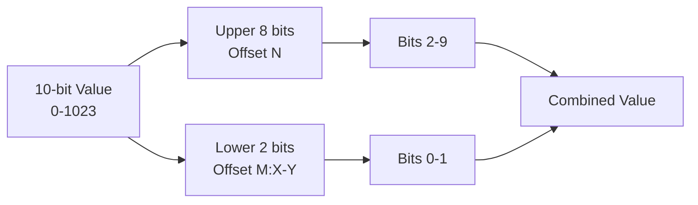
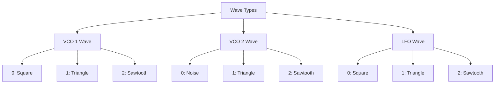
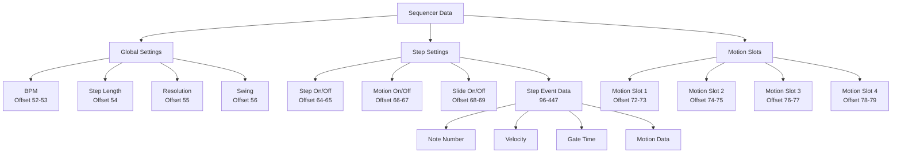
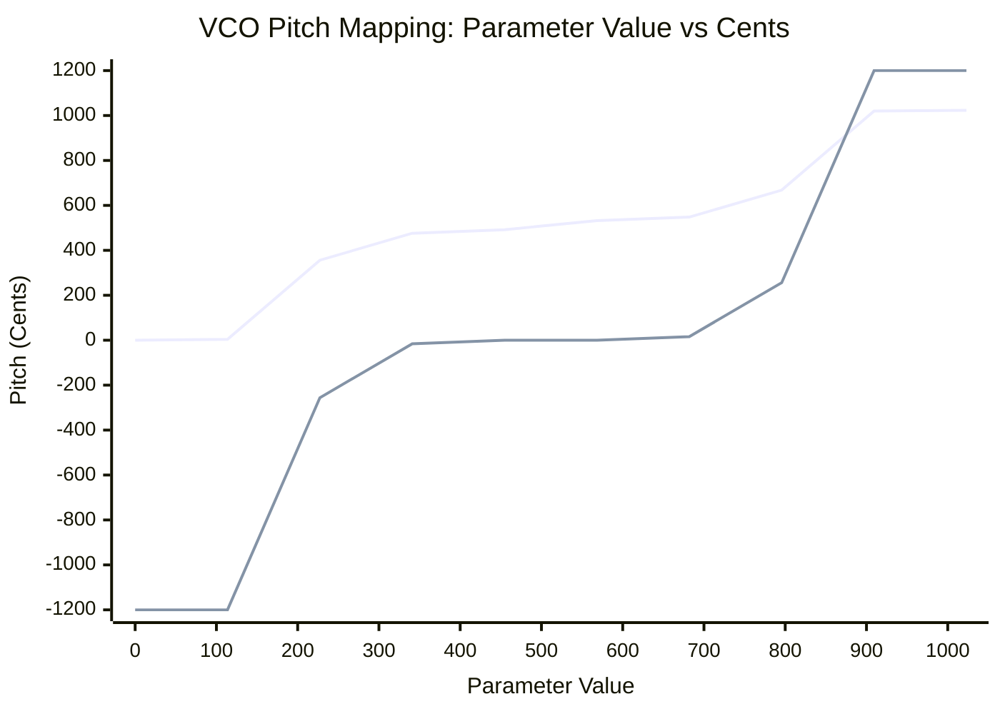
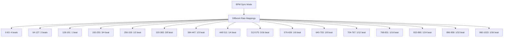
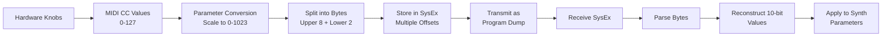

# Parameter Mapping

This document shows the mapping and relationships between different parameter systems in the Monologue synthesizer.

## Overview

The Korg Monologue uses a complex parameter mapping system where values are stored across multiple bytes with different bit ranges and encoding schemes.

### Communication Methods

There are two ways the hardware can send parameter data to the application:

| Method                  | Description                      | Real-time | Parameter Coverage | Value Range             |
| ----------------------- | -------------------------------- | --------- | ------------------ | ----------------------- |
| **SysEx Program Dump**  | Complete patch data transmission | No        | All parameters     | Full precision (10-bit) |
| **MIDI Control Change** | Individual parameter updates     | Yes       | Limited subset     | 7-bit (0-127)           |

### Parameter Communication Support

Not all parameters can be controlled via MIDI CC - some are only available through SysEx program dumps:

| Parameter       | MIDI CC Support    | SysEx Support | Notes                              |
| --------------- | ------------------ | ------------- | ---------------------------------- |
| VCO 1 Pitch     | ✅ Yes (CC varies) | ✅ Yes        | Real-time pitch control available  |
| Cutoff          | ✅ Yes (CC 74)     | ✅ Yes        | Real-time filter control available |
| Resonance       | ✅ Yes (CC 71)     | ✅ Yes        | Real-time filter control available |
| Program Name    | ❌ No              | ✅ Yes        | Text data, SysEx only              |
| Sequencer Steps | ❌ No              | ✅ Yes        | Complex data structure, SysEx only |

**Key Points:**

- **SysEx dumps** contain the complete patch state with full 10-bit precision
- **MIDI CC** messages provide real-time control but with reduced 7-bit precision (0-127)
- **Complex parameters** like sequencer data and patch names are only available via SysEx
- **Real-time performance** parameters typically support both methods

## Parameter Storage Structure

```mermaid
graph TD
    A[Program Data] --> B[VCO Parameters]
    A --> C[Filter Parameters]
    A --> D[Envelope Parameters]
    A --> E[LFO Parameters]
    A --> F[Sequencer Parameters]

    B --> B1[VCO 1 Pitch<br/>Offset 16 + 30:0-1]
    B --> B2[VCO 1 Shape<br/>Offset 17 + 30:2-3]
    B --> B3[VCO 1 Level<br/>Offset 20 + 33:0-1]
    B --> B4[VCO 1 Wave<br/>Offset 30:6-7]
    B --> B5[VCO 1 Octave<br/>Offset 30:4-5]

    B --> B6[VCO 2 Pitch<br/>Offset 18 + 31:0-1]
    B --> B7[VCO 2 Shape<br/>Offset 19 + 31:2-3]
    B --> B8[VCO 2 Level<br/>Offset 21 + 33:2-3]
    B --> B9[VCO 2 Wave<br/>Offset 31:6-7]
    B --> B10[VCO 2 Octave<br/>Offset 31:4-5]

    C --> C1[Cutoff<br/>Offset 22 + 33:4-5]
    C --> C2[Resonance<br/>Offset 23 + 33:6-7]

    D --> D1[Attack<br/>Offset 24 + 34:2-3]
    D --> D2[Decay<br/>Offset 25 + 34:4-5]
    D --> D3[EG Intensity<br/>Offset 28 + 35:0-1]
    D --> D4[EG Type<br/>Offset 34:0-1]
    D --> D5[EG Target<br/>Offset 34:6-7]

    E --> E1[LFO Rate<br/>Offset 27 + 35:2-3]
    E --> E2[LFO Intensity<br/>Offset 28 + 35:4-5]
    E --> E3[LFO Type<br/>Offset 36:0-1]
    E --> E4[LFO Mode<br/>Offset 36:2-3]
    E --> E5[LFO Target<br/>Offset 36:4-5]
```

## 10-bit Parameter Encoding

Many parameters use 10-bit values (0-1023) stored across two bytes:

## Wave Type Mapping

## Sequencer Structure

## Parameter Value Ranges

| Parameter     | Range  | Notes                   |
| ------------- | ------ | ----------------------- |
| VCO Pitch     | 0-1023 | Special cent mapping    |
| VCO Shape     | 0-1023 | Wave shape modulation   |
| VCO Level     | 0-1023 | Oscillator level        |
| Cutoff        | 0-1023 | Filter cutoff frequency |
| Resonance     | 0-1023 | Filter resonance        |
| EG Attack     | 0-1023 | Envelope attack time    |
| EG Decay      | 0-1023 | Envelope decay time     |
| LFO Rate      | 0-1023 | LFO speed               |
| LFO Intensity | 0-1023 | LFO modulation depth    |
| Drive         | 0-1023 | Overdrive amount        |

## Special Mappings

### VCO Pitch Mapping (Cents)

| Value Range | Cent Range    | Notes                     |
| ----------- | ------------- | ------------------------- |
| 0 - 4       | -1200         | Fixed at -1200 cents      |
| 4 - 356     | -1200 to -256 | Linear interpolation      |
| 356 - 476   | -256 to -16   | Linear interpolation      |
| 476 - 492   | -16 to 0      | Linear interpolation      |
| 492 - 532   | 0             | Fixed at 0 cents (center) |
| 532 - 548   | 0 to 16       | Linear interpolation      |
| 548 - 668   | 16 to 256     | Linear interpolation      |
| 668 - 1020  | 256 to 1200   | Linear interpolation      |
| 1020 - 1023 | 1200          | Fixed at +1200 cents      |

### LFO Rate BPM Sync Mapping

## Data Flow

This diagram shows how parameter values flow from hardware controls through MIDI processing to final synthesizer parameter application.
